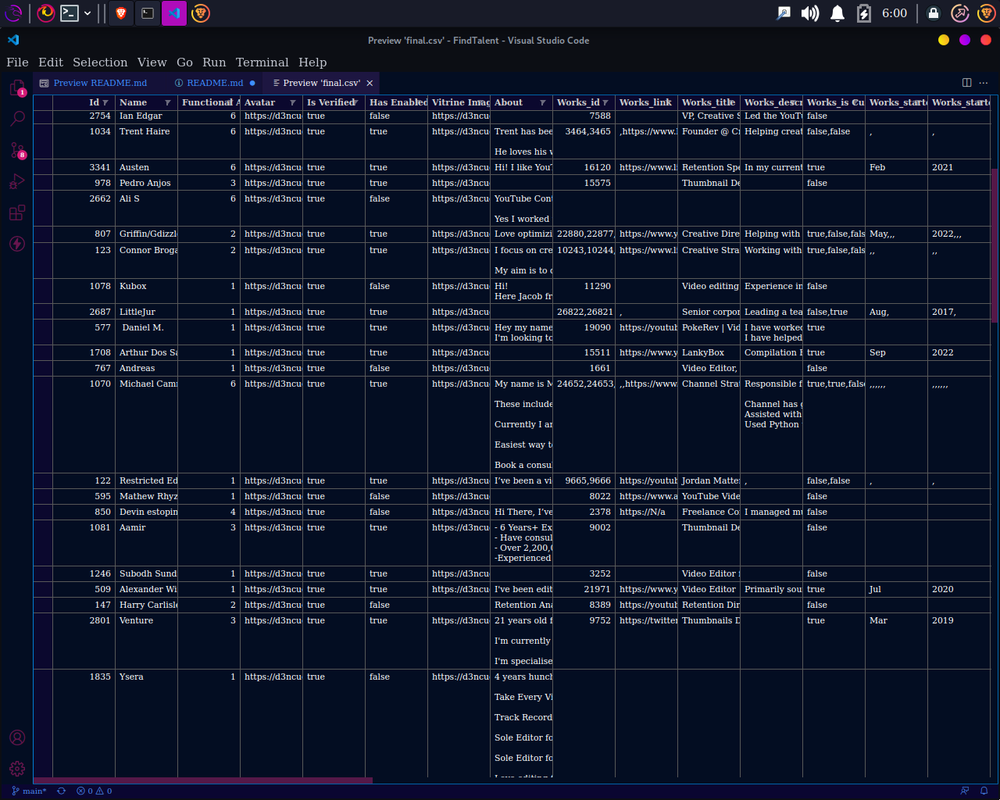

# FindTalent

## prerequisits

- node v-18

## setup

    // install all the modules needed via npm or yarn

    npm install

## start

    // to start the script

    npm start

## things to keep in mind

the script will scrap all the acounts in the tallent section of the website witch can get up to +6k account.

and then for each account it will get all the details for each profile.

it will take a while for all the acounts to be done.

## Final Note

the script when run correctly please do not delete the data.json file cz it is used to store the profiles without it after few 100 accounts scraped the scrapper will error out a memory leak fail.

## final output

the script will create a final a csv containing all the accounts.

